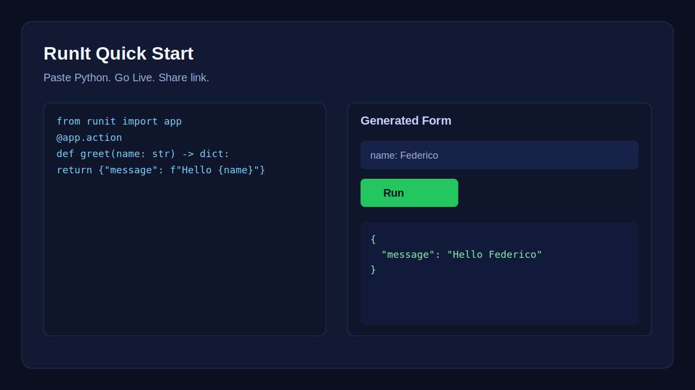
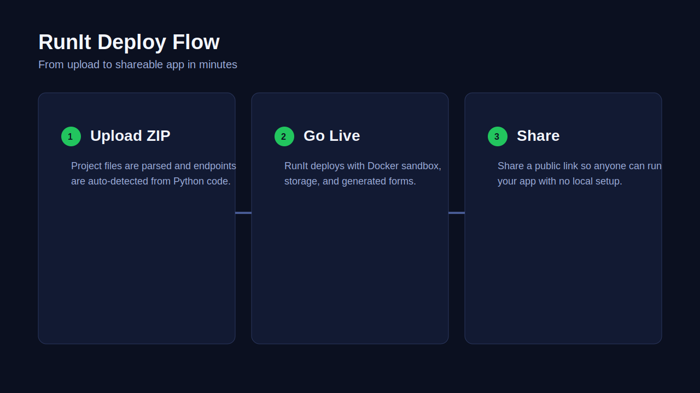

<div align="center">

# RunIt

### AI writes code. RunIt makes it real.

Auto-generated UI from type hints. Shareable link. Built-in storage. Self-hosted with Docker.


</div>

---

## Demo




## Try in 60 seconds

## Quick Start

```bash
docker run \
  -p 3000:3000 \
  -p 3001:3001 \
  -e NEXT_PUBLIC_API_URL=http://localhost:3001 \
  -e MASTER_ENCRYPTION_KEY="$(openssl rand -base64 32)" \
  ghcr.io/buildingopen/runit
```

Open [localhost:3000](http://localhost:3000). The API runs on [localhost:3001](http://localhost:3001).
Paste this:

```python
from runit import app

@app.action
def greet(name: str) -> dict:
    return {"message": f"Hello, {name}!"}
```

Hit "Go Live." Share the link. That's it.

## Three Copy-Paste Apps

- **Greeting app:** start with the snippet in Quick Start
- **Visit counter with memory:** [examples/visit-counter/main.py](examples/visit-counter/main.py)
- **Invoice generator:** [examples/invoice-generator/main.py](examples/invoice-generator/main.py)

See all examples in [examples/README.md](examples/README.md).

## How It Works

1. You write a Python function with type hints
2. RunIt extracts the schema (OpenAPI)
3. RunIt generates a web form from the schema
4. RunIt runs the function in a Docker sandbox
5. Anyone with the link can use it

## Your App Can Remember Things

```python
from runit import app, remember

@app.action
def count_visits(name: str) -> dict:
    visits = (remember("visits") or 0) + 1
    remember("visits", visits)
    return {"message": f"Hello {name}! Visit #{visits}"}
```

No database setup. Built-in key-value storage.

## Examples

| Example | What it does |
|---------|-------------|
| [Invoice Generator](examples/invoice-generator) | Create invoices with automatic tax calculation |
| [Text Analyzer](examples/text-analyzer) | Count words, find common phrases, detect sentiment |
| [Unit Converter](examples/unit-converter) | Convert temperatures and distances between units |
| [Visit Counter](examples/visit-counter) | Greet visitors and track counts with `remember()` |

---

## Self-Hosting

```bash
git clone https://github.com/buildingopen/runit
cd runit
docker-compose up --build
```

That starts the control plane API on `localhost:3001` with SQLite and Docker sandboxing.
For the all-in-one web + API container, use the Quick Start command above.

### Runtime defaults

- Web UI: `http://localhost:3000`
- Control plane API: `http://localhost:3001`
- Health check: `http://localhost:3001/health`

### Validated on fresh machine

- [ ] Quick Start container opens web on `3000` and API on `3001`
- [ ] `docker-compose up --build` serves `/health` on `3001`
- [ ] `npm run verify` passes
- [ ] `npx playwright test tests/e2e/golden-path.spec.ts` passes
- [ ] README commands match real behavior

<details>
<summary><strong>Environment Variables</strong></summary>

| Variable | Required | Default | Description |
|----------|----------|---------|-------------|
| `MASTER_ENCRYPTION_KEY` | Yes | | 32-byte base64 key for secrets encryption |
| `COMPUTE_BACKEND` | No | `docker` | `docker` for self-hosted |
| `PORT` | No | `3001` | Server port |
| `API_KEY` | No | | Bearer token to protect API |
| `RUNNER_IMAGE` | No | `runit-runner:latest` | Docker image for code execution |
| `RUNNER_MEMORY` | No | `512m` | Memory limit per container |
| `RUNNER_CPUS` | No | `1` | CPU limit per container |
| `RUNNER_NETWORK` | No | `none` | Network mode (`none` for isolation) |

See `.env.example` for the full list.

</details>

---

## For Developers

<details>
<summary><strong>Python SDK</strong></summary>

```python
from runit import app, remember, forget, storage

# Mark functions as actions
@app.action
def my_func(x: int) -> dict:
    return {"result": x * 2}

# Custom action name
@app.action(name="custom_name")
def another_func(y: str) -> dict:
    return {"greeting": f"Hello, {y}!"}

# Full storage API
storage.set("config", {"theme": "dark"})
data = storage.get("config")        # {"theme": "dark"}
storage.get("missing", default=0)   # 0
storage.list()                       # ["config"]
storage.delete("config")
```

</details>

<details>
<summary><strong>CLI</strong></summary>

```bash
npm install -g @runit/cli

# Deploy a Python file
runit deploy my-app.py --name "My App"

# List your apps
runit list

# View logs
runit logs

# Check local setup
runit doctor

# Manage storage
runit storage list
runit storage get <key>
runit storage set <key> <value>

# Share your app
runit share create <endpoint_id>
```

</details>

<details>
<summary><strong>MCP Server (for AI agents)</strong></summary>

```bash
npm install -g @runit/mcp-server
```

Gives AI agents (Claude, Cursor, etc.) tools to deploy code, run actions, and manage storage.

</details>

<details>
<summary><strong>API Reference</strong></summary>

All routes are under `/v1/`. Full OpenAPI spec at `/v1/openapi.json`.
Human-friendly API docs landing: `/docs`.

**Apps:** `GET /v1/projects`, `POST /v1/projects`, `GET /v1/projects/:id`, `DELETE /v1/projects/:id`

**Deploy:** `POST /v1/projects/:id/deploy`, `GET /v1/projects/:id/deploy/status`

**Runs:** `POST /v1/runs`, `GET /v1/runs/:id`

**Secrets:** `POST /v1/projects/:id/secrets`, `GET /v1/projects/:id/secrets`

**Storage:** `GET /v1/projects/:id/storage`, `PUT /v1/projects/:id/storage/:key`, `GET /v1/projects/:id/storage/:key`

</details>

<details>
<summary><strong>Architecture</strong></summary>

```
Function (type hints) -> OpenAPI Schema -> Auto-generated Form -> Shareable Link
                              |
                         Docker Sandbox
                              |
                           SQLite
```

```
runit/
+-- apps/web/                  # Next.js web app (paste, deploy, run, share)
+-- packages/
|   +-- cli/                   # CLI: runit deploy, runit run, ...
|   +-- client/                # TypeScript API client
|   +-- mcp-server/            # MCP tools for AI agents
|   +-- openapi-form/          # Auto-generates web forms from functions
|   +-- shared/                # TypeScript types and contracts
|   +-- ui/                    # Shared React components
+-- services/
|   +-- control-plane/         # Hono.js API server
|   +-- runner/                # Python execution runtime + SDK
```

</details>

<details>
<summary><strong>Development</strong></summary>

```bash
npm install
npm run build   # Build all packages
npm test        # Run all tests
```

</details>

## Why teams pick RunIt

- Turn Python functions into usable apps without building frontend forms by hand
- Keep execution isolated with Docker sandboxing
- Keep state simple with built-in `remember()` storage
- Share links instantly for demos, internal tools, and experiments

## Launch Kit

- 2-minute onboarding guide: [docs/LAUNCH_FIRST_APP.md](docs/LAUNCH_FIRST_APP.md)
- Distribution copy for launch channels: [docs/LAUNCH_KIT.md](docs/LAUNCH_KIT.md)
- PRR scorecard and go/no-go checks: [docs/PRR_SCORECARD.md](docs/PRR_SCORECARD.md)

## Contributing

See [CONTRIBUTING.md](CONTRIBUTING.md) for guidelines.

## License

MIT. See [LICENSE](LICENSE).
</div>
