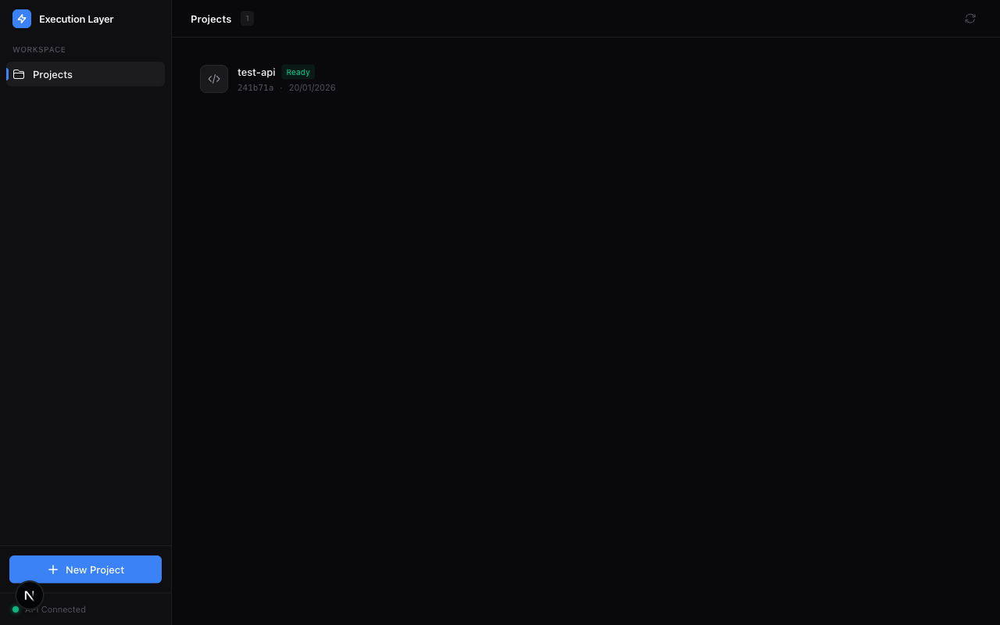
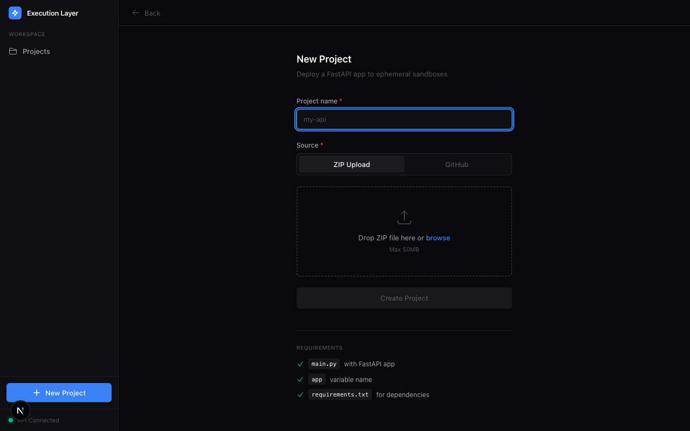
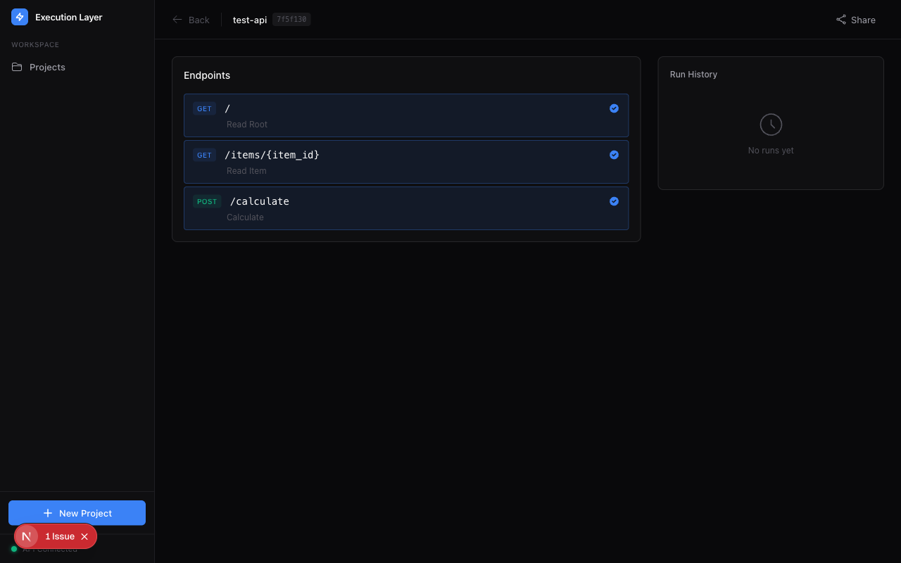
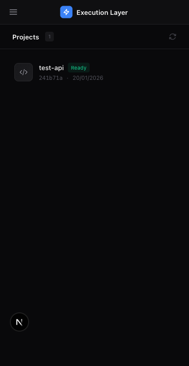

# Execution Layer - Product Audit Report

**Generated:** 2026-01-20 16:50:00

---

## Executive Summary

Comprehensive product audit of the Execution Layer web application. The app allows users to deploy FastAPI projects to ephemeral sandboxes and execute endpoints via a web interface.

**Overall Status:** ✅ Core functionality works, with some UI/UX issues to address

---

## Test Environment

- **Frontend:** http://localhost:3000 (Next.js)
- **Backend:** http://localhost:3001 (Hono control-plane)
- **Database:** In-memory (dev mode)
- **Test Project:** test-api with 3 endpoints

---

## Pages Audited

| Page | Status | HTTP | Notes |
|------|--------|------|-------|
| Homepage | ✅ Pass | 200 | Shows project list correctly |
| New Project Page | ✅ Pass | 200 | Form and upload work |
| Project Page | ✅ Pass | 200 | Endpoints displayed |
| Error Page (404) | ✅ Pass | 200 | Proper error handling |
| Mobile Homepage | ✅ Pass | 200 | Responsive layout works |

---

## Detailed Findings

### Homepage



**Positive:**
- Clean dark theme with left sidebar navigation
- Project list shows correctly with name, status badge, version hash, date
- "API Connected" indicator with green dot
- "+ New Project" CTA clearly visible
- Responsive layout

**Observed:**
- Project shows "Ready" status badge (green)
- Version hash displayed (241b71a)
- Date formatting works (20/01/2026)

---

### New Project Page



**Positive:**
- Clear form with project name input
- Source selector (ZIP Upload / GitHub tabs)
- Drag-and-drop file upload area with "browse" link
- Max file size noted (50MB)
- Requirements checklist is helpful:
  - ✓ `main.py` with FastAPI app
  - ✓ `app` variable name
  - ✓ `requirements.txt` for dependencies
- Back navigation present

**Excellent UX design** - clear instructions, good visual hierarchy

---

### Project Run Page



**Positive:**
- Project name and version displayed in header
- "Back" navigation and "Share" button
- Endpoints section shows all 3 extracted endpoints:
  - GET `/` - Read Root
  - GET `/items/{item_id}` - Read Item
  - POST `/calculate` - Calculate
- Each endpoint shows method badge (GET/POST) and description
- Green checkmarks indicate endpoints are ready
- Run History panel (empty state shows "No runs yet")

**Issues Found:**
- ⚠️ "1 Issue" badge visible in sidebar (needs investigation)
- 🐛 **Bug:** Endpoints with query parameters (not JSON body) don't show input fields

---

### Error Handling

.png)

**Positive:**
- Proper error page with clear message: "Failed to load project"
- Subtitle: "Project not found"
- "Back to Projects" navigation button
- Clean design with warning icon

**Previously observed issue (now fixed):**
- ~~Infinite loading spinner~~ → Now shows proper error message

---

### Mobile Responsiveness



**Positive:**
- Layout adapts well to 375x667 viewport
- Hamburger menu icon in header
- Content stacks vertically appropriately
- All elements remain accessible

---

## API Testing Results

### Project Creation
```bash
POST /projects → 201 Created
{
  "project_id": "0006ed52-...",
  "project_slug": "test-api-0006ed52",
  "version_id": "7f5f1303-...",
  "status": "ready"
}
```
✅ Successfully creates project with OpenAPI extraction

### Endpoint Listing
```bash
GET /projects/{id}/endpoints → 200 OK
{
  "endpoints": [3 endpoints],
  "total": 3
}
```
✅ Returns all extracted endpoints

### Endpoint Schema
```bash
GET /projects/{id}/versions/{vid}/endpoints/{eid}/schema → 200 OK
{
  "endpoint_id": "post--calculate",
  "parameters": [{name: "a", type: "integer"}, {name: "b", type: "integer"}]
}
```
✅ Returns schema with query parameters

---

## Issues Summary

| Priority | Issue | Location | Description |
|----------|-------|----------|-------------|
| 🔴 High | Query param form missing | Project Page | Endpoints with query parameters show "Run" button but no input fields |
| 🟡 Medium | "1 Issue" badge | Sidebar | Unexplained issue indicator needs investigation |
| 🟢 Low | Modal not tested | Run execution | Requires Modal credentials to test actual execution |

---

## Bug Details

### Query Parameter Form Missing

**Steps to Reproduce:**
1. Create a project with a FastAPI endpoint that has query parameters
2. Navigate to the project page
3. Click on the endpoint

**Expected:** Form shows input fields for query parameters (a, b)
**Actual:** Only shows "This endpoint doesn't require a request body" and a "Run" button

**Root Cause:** The web app checks for `request_schema` (JSON body) but doesn't render input fields for `parameters` (query params)

**Affected Code:** `apps/web/app/p/[project_id]/page.tsx:305-319`

---

## Recommendations

### Critical Fixes

1. **Add query parameter form inputs**
   - When `parameters` array exists in schema, render input fields
   - Support different parameter types (integer, string, etc.)
   - Pass parameters to the run API

2. **Investigate "1 Issue" badge**
   - Check what triggers this indicator
   - Ensure it shows meaningful information to users

### Improvements

1. **Form validation** - Add client-side validation for required parameters
2. **Error messages** - Show more specific error messages when runs fail
3. **Loading states** - Add better feedback during endpoint execution

---

## Verification

- [x] Backend services started and running
- [x] Project creation via API works
- [x] OpenAPI extraction successful (3 endpoints)
- [x] Web app displays project list
- [x] Web app displays endpoints
- [x] Error handling works for non-existent projects
- [x] Mobile responsive layout verified
- [x] Screenshots captured for all pages
- [ ] Actual endpoint execution (requires Modal credentials)

---

## Screenshots

All screenshots saved to: `audit-screenshots/`

- `homepage.png` - Homepage with project list
- `new-project-page.png` - New project form
- `project-page.png` - Project with endpoints
- `error-handling-(404).png` - Error page
- `homepage-mobile.png` - Mobile responsive view
- `endpoint-test-*.png` - Endpoint interaction tests

---

## Files Created During Audit

- `test-project/main.py` - Sample FastAPI app
- `test-project/requirements.txt` - Dependencies
- `test-project.zip` - ZIP for upload testing
- `product-audit-playwright.py` - Automated audit script
- `test-endpoint-ui.py` - Endpoint interaction test

---

*Audit completed: 2026-01-20*
